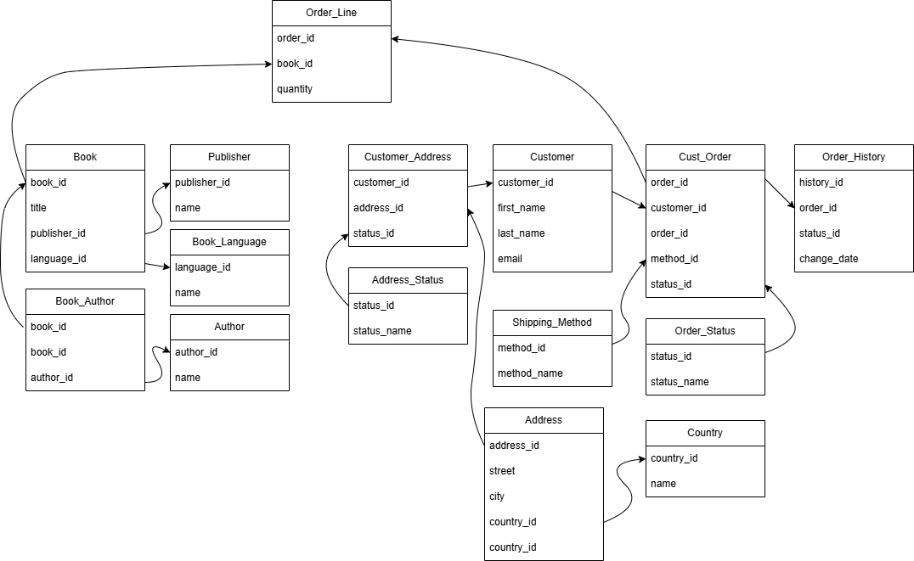

# Database-Design-Groupwork-Assignment

## Bookstore Database Design & Programming with SQL

This project was developed as part of the course/workshop: "Database Design & Programming with SQL" with The Power Learn Project.

### Overview

In this project, we took on three roles.  

1. A database administrator responsible for designing and implementing a MySQL database for a bookstore.

2. A bookstore manager responsible inventory management.

3. A sales manager responsible for order processing and customer management. 

The objective is to build a structured, efficient, and scalable system to manage essential data such as books, authors, customers, orders, and shipping.

### Tools and Technologies Used:

1. MySQL – For designing, creating, and managing the relational database

2. Draw.io – For visualizing the database schema and entity-relationship diagrams (ERD)

### Prerequisites:

Before starting this project, we had a solid understanding of:

1. MySQL fundamentals in creating tables and defining relationships

2. Choosing appropriate data types

3. Writing SQL queries

4. Managing users and setting up roles and permissions in MySQL

### Project Objective:

Design and implement a relational database to support the full operations of a bookstore, covering:

1. Inventory (books, authors, languages, publishers)

2. Customers and their addresses

3. Orders and order processing

4. Shipping methods and order tracking

We created a schema that allows efficient data storage, quick retrieval, and meaningful analytics.

### User Management:

We created user groups and assigned roles with appropriate permissions for database access and security.

### Test the System:

Run SQL queries to test data insertion, retrieval, joins, and security rules.

### Tables We Created:

1. book: Stores details of all books available in the store
2. book_author:	Manages the many-to-many relationship between books and authors
3. author:	Contains author information
4. book_language:	Lists possible languages for books
5. publisher:	Contains publisher details
6. customer:	Stores customer information
7. customer_address:	Links customers to multiple addresses
8. address_status:	Defines address types (e.g., current, old)
9. address:	Contains physical address data
10. country:	Lists all countries tied to addresses
11. cust_order:	Stores customer order details
12. order_line:	Contains books associated with each order
13. shipping_method:	Lists available shipping methods
14. order_history:	Records order events and changes over time
15. order_status:	Defines different order statuses (e.g., pending, shipped, delivered)

### Authors:
1. Lilian Igwegbe
2. Lucylle Makachia
3. Sharon Kipsang
